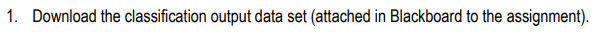
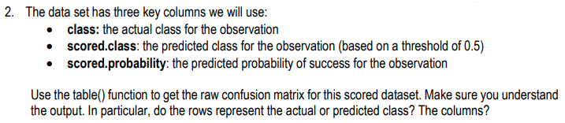
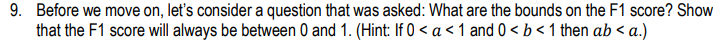
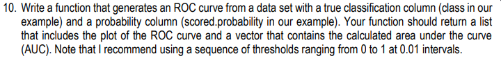
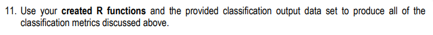
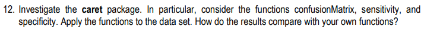
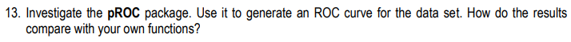

```{r setup, include=FALSE}
knitr::opts_chunk$set(echo = TRUE)
knitr::opts_chunk$set(tidy = TRUE)
knitr::opts_chunk$set(warning = FALSE)

libs <- c("knitr", "tidyverse", "magrittr", "data.table", "kableExtra", "caret", "pROC", "zoo")

loadPkg <- function(x) {
  if(!require(x, character.only = T)) install.packages(x, dependencies = T)
  require(x, character.only = T)
}

lapply(libs, loadPkg)
```

## Question 1

```{r data, message=FALSE}
data <- fread("https://raw.githubusercontent.com/baroncurtin2/data621/master/week2/classification-output-data.csv") %>%
  as_tibble() %>%
  select(class:scored.probability)
```

## Question 2

```{r}
summary(data)
```

```{r}
with(data, table(class, scored.class))
```
  * The rows represent the actual classes
  * The columns represent the predicted classes

```{r}
# confusion matrix helper function
conf_mtx <- function(df) {
  df %>%
    summarise(tp = sum(class == 1 & scored.class == 1),
            tn = sum(class == 0 & scored.class == 0),
            fp = sum(class == 0 & scored.class == 1),
            fn = sum(class == 1 & scored.class == 0))
}
```


## Question 3

```{r}
accuracy <- function(df) {
  # mtx
  x <- conf_mtx(df)
  
  # return accuracy
  return((x$tp + x$tn)/nrow(df))
}

# get accuracy
accuracy(data)
```


## Question 4


```{r}
cer <- function(df) {
  # mtx
  x <- conf_mtx(df)
  
  # return accuracy
  return((x$fp + x$fn)/nrow(df))
}

# get cer
cer(data)

# sum to 1 check
accuracy(data) + cer(data) == 1
```


## Question 5

```{r}
precision <- function(df) {
  # mtx
  x <- conf_mtx(df)
  
  # return precision
  return(x$tp/(x$tp + x$fp))
}

# get precision
precision(data)
```


## Question 6

```{r}
sensitivity <- function(df, opt = "class", threshold = .5) {
  # df = 3 column
  # 1st = actual class / 2nd = predicted class / 3rd = predicted probability
  
  # true positive 
  tp <- if_else(opt == "class",
                sum(df[, 1] == 1 & df[, 2] == 1),
                sum(df[, 1] == 1 & df[, 3] > threshold))
  
  # false negative
  fn <- if_else(opt == "class",
                sum(df[, 1] == 1 & df[, 2] == 0),
                sum(df[, 1] == 1 & df[, 3] <= threshold))
  
  # return sensitivty
  return(tp/(tp + fn))
}

sensitivity(data)
```


## Question 7

```{r}
specificity <- function(df, opt = "class", threshold = .5) {
  # df = 3 column
  # 1st = actual class / 2nd = predicted class / 3rd = predicted probability
  
  # true negatives
  tn <- if_else(opt == "class", 
                sum(df[, 1] == 0 & df[, 2] == 0),
                sum(df[, 1] == 0 & df[, 3] <= threshold))
  
  # false positives
  fp <- if_else(opt == "class", 
                sum(df[, 1] == 0 & df[, 2] == 1),
                sum(df[, 1] == 0 & df[, 3] > threshold))
  
  # return specificity
  return(tn/(tn + fp))
}

specificity(data)
```


## Question 8

```{r}
f1score <- function(df) {
  return((2 * precision(df) * sensitivity(df))/(precision(df) + sensitivity(df)))
}

f1score(data)
```


## Question 9

```{r}
p <- runif(1000, min = 0, max = 1)
s <- runif(1000, min = 0, max = 1)
f <- (2*p*s)/(p+s)
summary(f)

data_frame(a = p, b = s, ab = p * s, proof = ab < a) %>%
  summary(n())
```
  * A simulation of 1000 was created to show that F1 will always be between 0 and 1
  * Based on 0 < a < 1 and 0 < b < 1, then a*b < a, we see that there 1000 TRUEs


## Question 10

```{r}
rocCurve <- function(df, int = 100) {
  # first column = class / second = scored.probability
  thresholds <- seq(0, 1, by = 1/int)
  
  # generate sensitivty
  sens <- thresholds %>%
    map_dbl(function(x) sensitivity(df = data, opt = "prob", threshold = x)) %>%
    sort()
  
  # generate specificity
  spec <- thresholds %>%
    map_dbl(function(x) (1 - specificity(df = data, opt = "prob", threshold = x))) %>%
    sort()
  
  # generate plot
  plotdf <- data_frame(x = spec, y = sens)
  g <- ggplot(plotdf, aes(x = x, y = y)) +
    geom_line() +
    geom_abline(intercept = 0, slope = 1) +
    #geom_smooth() +
    labs(x = "Specificity", y = "Sensitivity", title = "Custom ROC Curve")
  
  # calculate area under curve
  auc <- sum(diff(spec) * rollmean(sens, 2))
  
  # return list of items
  return(list(plot = g,
              AUC = auc))
}

myCurve <- rocCurve(data) %>%
  print
```


## Question 11

```{r}
metric <- c("accuracy", "cer", "precision", "sensitivity", "specificity", "f1score") %>%
  data_frame(metric = ., 
           value = map_dbl(metric, .f = function(x) get(x)(df = data)))
```

## Question 12

```{r}
cMatrix <- confusionMatrix(as.factor(data$scored.class), as.factor(data$class), positive = "1", mode = "everything") %>%
  print
```

```{r}
# compare to homemade functions
metric %>%
  bind_cols(., caret = c(cMatrix$overall[[1]],
                 1 - cMatrix$overall[[1]],
                 cMatrix$byClass[c(5, 1, 2, 7)])) %>%
  mutate(match = round(value, 8) == round(caret, 8))
```
  * The custom functions match caret up to 8 digits

## Question 13

```{r}
curveROC <- roc(data$class, data$scored.probability)
plot(curveROC, legacy.axes = T, main = "pROC")
```

```{r}
data_frame(custom = c(myCurve$AUC), ROC = as.numeric(curveROC$auc)) %>%
  mutate(match = ROC - custom)
```


## Code Appendix

```{r, ref.label=knitr::all_labels(),echo=TRUE,eval=FALSE}
```