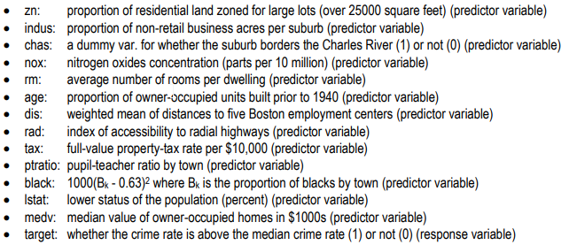
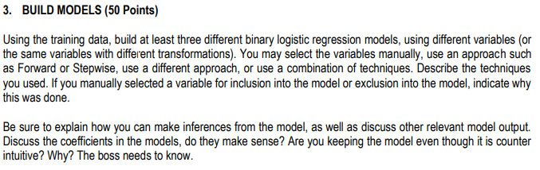
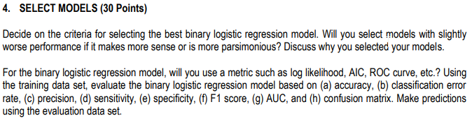

## Cover Page

Data 621 - Week 3 HW

Baron Curtin

CUNY School of Professional Studies


```{r setup, include=FALSE}
knitr::opts_chunk$set(echo = TRUE)
knitr::opts_chunk$set(tidy = TRUE)
knitr::opts_chunk$set(warning = FALSE)

libs <- c("knitr", "magrittr", "data.table", "kableExtra", "caret", "pROC", "zoo", "ISLR", "leaps", "fBasics", "reshape2", "tidyverse", "GGally", "gridExtra", "ROCR")

loadPkg <- function(x) {
  if(!require(x, character.only = T)) install.packages(x, dependencies = T)
  require(x, character.only = T)
}

lapply(libs, loadPkg)
```


```{r data, message=FALSE, include=FALSE}
crimeTraining <- fread("https://raw.githubusercontent.com/baroncurtin2/data621/master/week3/crime-training-data.csv") %>%
  as.tibble()
crimeTest <- fread("https://raw.githubusercontent.com/baroncurtin2/data621/master/week3/crime-evaluation-data.csv") %>%
  as.tibble()
```


## Introduction
The purpose of this assignment is to develop a binary logistic model that can "reliably" predict whether a neighborhood is at risk for high crime levels


## Data Exploration


### Non-Visual Inspection

#### Variables

  * Response Variable: target
  * Explanatory Variables:
```{r}
data_frame(explanatory_variables = names(crimeTraining)) %>%
  filter(explanatory_variables != "target") %>%
  arrange(explanatory_variables)
```


```{r}
glimpse(crimeTraining)
```

The glipmse function of dplyr shows us that there are `r nrow(crimeTraining)` observations and `r ncol(crimeTraining)` variables  
  * 10 variables of type dble  
  * 4 variables of type int  

```{r}
summary(crimeTraining)
```
  * Summary is able to show that none of the variables have missing values
  * The mean of target is below .5 which means there are more observations where the crime rate is below the median

#### Basic Stats
```{r}
crimeStats <- basicStats(crimeTraining)[c("nobs", "NAs", "Minimum", "Maximum", "1. Quartile", "3. Quartile", "Mean", "Median", "Variance", "Stdev", "Skewness", "Kurtosis"),] %>%
  as_tibble() %>%
  rownames_to_column() %>%
  gather(var, value, -rowname) %>%
  spread(rowname, value) %>%
  rename_all(str_to_lower) %>%
  rename_all(str_trim) %>%
  rename(variables = "var",
         "q1" = `1. quartile`,
         "q3" = `3. quartile`,
         "max"= maximum,
         "min" = minimum,
         "na_vals" = nas, 
         "n" = nobs,
         "sd" = stdev,
         "var" = variance) %>%
  mutate(obs = n - na_vals,
         range = max - min,
         iqr = q3 - q1) %>%
  select(variables, n, na_vals, obs, mean, min, q1, median, q3, max, sd, var, range, iqr, skewness, kurtosis) %>%
  as_tibble()

crimeStats
```
  * basicStats is further able to confirm no missing values
  * The variable black has the highest variance
  * The largest skew value is ~3.3 with the chas variable
    + This variable is just a dummy variable for whether the subrub borders the Charles River
    
#### Correlation
```{r}
crimeTraining %>%
  cor(use = "na.or.complete") %>%
  as.data.frame() %>%
  rownames_to_column(var = "predictor") %>%
  as_data_frame() %>%
  select(predictor, target) %>%
  filter(predictor != "target") %>%
  arrange(desc(target))
```
  * The correlation table above shows that nox has the strongest positive correlation with target and dis has the strongest negative correlation with target

```{r}
ggcorr(crimeTraining, palette = "RdBu", label = T, geom = "tile")
```
  * The correlation matrix shows *tax* and *rad* have the highest correlation to each other

### Visual Inspection

#### Density Plots
```{r}
vis <- melt(crimeTraining)

ggplot(vis, aes(value)) +
  geom_density(fill = "skyblue") +
  facet_wrap(~ variable, scales = "free")
```
  
  * The variable rm is the only variable that closely mirrors a normal distribution  
  * The variables zn, chas, and dis are heavily skewed right  
  * The variables nox, lstat, and medv are are also skewed right  
  * indus, rad, tax, and target are multi-modal  
  * The density plots reveal that most is the data is not normal  

#### Histogram
```{r}
crimeTraining %>%
  mutate(target = as.factor(target)) %>%
  keep(is.numeric) %>%
  gather() %>%
  ggplot(aes(value)) +
  geom_histogram(bins = 35) +
  facet_wrap(~ key, scales = "free")
```
  
  * The histograms provide a clearer picture of skew revealing that age, dis, lstat are skewed  
  * The variables are candidates for transformation  


#### Box Plots
Box plots are provide good visual representations of the variance in the data
```{r}
ggplot(vis, aes(x = variable, y = value)) +
  geom_boxplot(show.legend = T) +
  stat_summary(fun.y = mean, color = "red", geom = "point", shape = 18, size = 3) +
  coord_flip()
```
  
  * The box plots reveal that many of the variables have low variances  

Removing the tax, and black variables...  
```{r}
vis %>%
  filter(!variable %in% c("tax", "black")) %>%
  ggplot(aes(x = variable, y = value)) +
  geom_boxplot(show.legend = T) +
  stat_summary(fun.y = mean, color = "red", geom = "point", shape = 18, size = 3) +
  coord_flip()
```
  
  * Removing the tax and black variable made it easier to see that almost all of the variables are skewed as the means and medians do not align  
  * Of the remaining variables, zn and age appear to have the highest variances  

Removing the zn and age variables...
```{r}
vis %>%
  filter(!variable %in% c("tax", "black", "zn", "age")) %>%
  ggplot(aes(x = variable, y = value)) +
  geom_boxplot(show.legend = T) +
  stat_summary(fun.y = mean, color = "red", geom = "point", shape = 18, size = 3) +
  coord_flip()
```
  
  * Many of the variables are skewed right as the mean appears to the right of the median  


## Data Preparation


To reduce the effect of skew on the model, logistic transformations will be performed on *age, dis, lstat*
```{r}
transCrime <- crimeTraining %>%
  mutate_at(c("age", "dis", "lstat"), log)
```

## Build Models



### Leaps subsetting

#### Untransformed Data
```{r}
regDiags <- regsubsets(target ~ ., data = crimeTraining, method = "exhaustive", nvmax = NULL, nbest = 1)
diagSum <- summary(regDiags)
print(diagSum)
```

```{r}
# determine best fits
plot(diagSum$cp, xlab = "Number of Variables", ylab = "Cp")
points(which.min(diagSum$cp), diagSum$cp[which.min(diagSum$cp)], pch = 20, col = "red")

# cp plot
par(mfrow=c(1,2))
plot(regDiags, scale = "Cp", main = "Cp")

# r^2 splot
plot(regDiags, scale = "adjr2", main = "Adjusted R^2")
```
  
  * Based on Cp, a model that includes *nox, age, rad, ptratio, and medv* would be the best predictor  
  * Based on Adjusted R^2, a model that includes *nox, age, rad, tax, ptratio, black, and medv* would be the best predictor  
  * Both metrics share the *nox, age, rad, ptratio, and medv* variables  

##### Model 1
```{r}
m1 <- glm(target ~ nox + age + rad + ptratio + medv, family = "binomial"(link="logit"), data = crimeTraining)
summary(m1)
```
  
  * *nox* has the greatest impact by far on *target*  
  * *age* has the minimum impact on *target*  

##### Model 2
```{r}
m2 <- glm(target ~ nox + age + rad + tax + ptratio + black + medv, family = "binomial"(link="logit"), data = crimeTraining)
summary(m2)
```
  
  * *nox* has the greatest impact by far on *target*
  * *tax* has the minimum impact on *target* and is also negative
  * Positive coefficients: nox, age, rad, ptratio, medv
  * Negative coefficients: tax, black
    + Interesting to note that black has a negative impact

##### Model 3: All Variables
```{r}
m3 <- glm(target ~ ., family = "binomial"(link="logit"), data = crimeTraining)
summary(m3)
```
  
  * *nox* has the greatest impact by far on *target*
  * *tax* has the minimum impact on *target* and is also negative
  * Positive coefficients: chas, nox, age, dis, rad, ptratio, lstat, medv
  * Negative coefficients: zn, indus, rm, tax, black
    + Interesting to note that black has a negative impact

#### Transformed Data
```{r}
regDiags2 <- regsubsets(target ~ ., data = transCrime, method = "exhaustive", nvmax = NULL, nbest = 1)
diagSum2 <- summary(regDiags2)
print(diagSum2)
```


```{r}
# determine best fits
plot(diagSum2$cp, xlab = "Number of Variables", ylab = "Cp")
points(which.min(diagSum2$cp), diagSum2$cp[which.min(diagSum2$cp)], pch = 20, col = "red")

# cp plot
par(mfrow=c(1,2))
plot(regDiags2, scale = "Cp", main = "Cp")

# r^2 splot
plot(regDiags2, scale = "adjr2", main = "Adjusted R^2")
```

  * Based on Cp, a model that includes *zn, nox age, rad, and medv* would be the best predictor
  * Based on Adjusted R^2, a model that includes *zn, nox age, rad, ptratio, black, lstat, and medv* would be the best predictor

##### Model 4
```{r}
m4 <- glm(target ~ zn + nox + age + rad + medv, family = "binomial"(link="logit"), data = transCrime)
summary(m4)
```
  
  * *nox* has the greatest impact by far on *target*
  * *zn* has the minimum impact on *target* and is also negative
  * Positive coefficients: nox, age, rad, medv
  * Negative coefficients: zn


##### Model 5
```{r}
m5 <- glm(target ~ zn + nox + age + rad + ptratio + black + lstat + medv, family = "binomial"(link="logit"), data = transCrime)
summary(m5)
```

  * *nox* has the greatest impact by far on *target*
  * *zn* has the minimum impact on *target* and is also negative
  * Positive coefficients: nox, age, rad, ptratio, lstat, medv
  * Negative coefficients: zn, black
    + Interesting to note that black has a negative impact on *target*


##### Model 6: All Variables
```{r}
m6 <- glm(target ~ ., family = "binomial"(link="logit"), data = transCrime)
summary(m6)
```
  
  * *nox* has the greatest impact by far on *target*
  * *tax* has the minimum impact on *target* and is also negative
  * Positive coefficients: chas, nox, age, dis, rad, ptratio, lstat, medv
  * Negative coefficients: zn, indus, rm, tax, black
    + Interesting to note that black has a negative impact on *target*

## Select Models



We will use the Adjusted R^2 to select the best model. Based on the R^2, Model 2 & Model 5 are the best linear models. Both R^2 sat at .61, however we will use Model 2 (without transfromations).

### Evaluation

#### Model 2
```{r}
par(mfrow=c(2,2))

plot(m2)
hist(m2$residuals)
qqnorm(m2$residuals)
qqline(m2$residuals)
```
  
  * The histogram of the residuals do not show a normal distribution
  * The qqplot shows a fairly linear relationship, the only exception being towards the tail end of the residuals
  * The residual indicates that there is not constant variance throughout, as there is a noticable pattern around 0
  
##### Test Model
```{r}
trainingMinus <- crimeTraining %>%
  select(-target)

test_results <- predict(m2, newdata = trainingMinus, type = "response")

df <- bind_cols(crimeTraining, data.frame(scored_target = test_results)) %>%
  mutate(scored_target = if_else(scored_target > .5, 1, 0)) %>%
  print
```


##### Performance
```{r}
cm <- confusionMatrix(as.factor(df$scored_target), as.factor(df$target), positive = "1", mode = "everything") %>%
  print

curveRoc <- roc(df$target, df$scored_target)
plot(curveRoc, legacy.axes = T, main = "pROC")
```
  
  * The model used had a ~90% accuracy  
  * The CER is ~10%  
  * Precision was ~95%  
  * Negative prediction rate was only ~87% significant down from the positive prediction rate of ~95%  
    + The model struggled more with predicting negatives  
  * The sensitivity is ~.85  
  * The specificity is ~.95  
  * The F1 is ~.89  
  * The AUC is `r curveRoc$auc`
  

##### Prediction for Test Data
```{r}
test_results <- predict(m2, newdata = crimeTest, type = "response")
bind_cols(crimeTest, data.frame(scored_target = test_results)) %>%
  mutate(scored_target = if_else(scored_target > .5, 1, 0)) %>%
  print
```


## Code Appendix

```{r, ref.label=knitr::all_labels(),echo=TRUE,eval=FALSE}
```