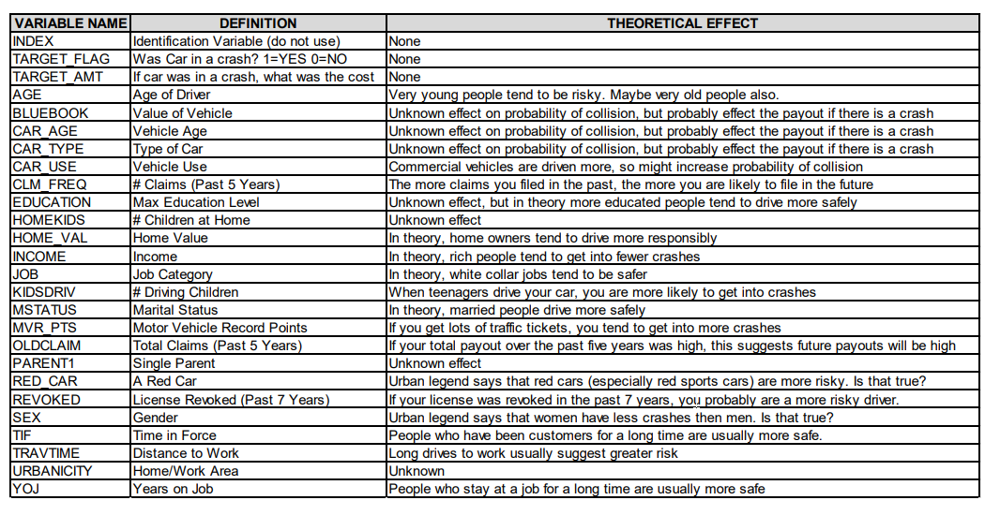
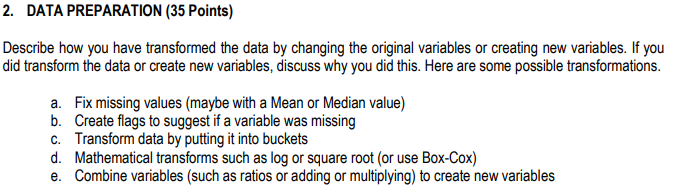
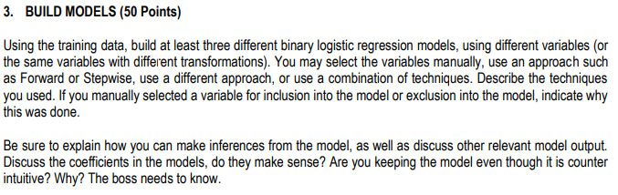
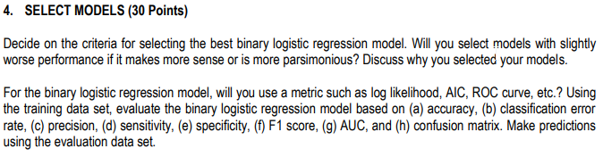

## Cover Page

Data 621 - Week 4 HW

Baron Curtin

CUNY School of Professional Studies


```{r setup, include=FALSE}
knitr::opts_chunk$set(echo = FALSE)
knitr::opts_chunk$set(tidy = TRUE)
knitr::opts_chunk$set(warning = FALSE)

loadPkg <- function(x) {
  if(!require(x, character.only = T)) install.packages(x, dependencies = T, repos = "http://cran.us.r-project.org")
  require(x, character.only = T)
}

libs <- c("knitr", "magrittr", "data.table", "kableExtra", "caret", "pROC", "missForest", "zoo", "ISLR", "leaps", "fBasics", "reshape2", "tidyverse", "GGally", "gridExtra", "ROCR")

lapply(libs, loadPkg)
```

```{r}
insTraining <- fread("https://raw.githubusercontent.com/baroncurtin2/data621/master/week4/insurance_training_data.csv") %>%
  as.tibble()
insTest <- fread("https://raw.githubusercontent.com/baroncurtin2/data621/master/week4/insurance-evaluation-data.csv") %>%
  as.tibble()
```


## Introduction
The purpose of this assignment is to generate multiple linear regression and binary logistic regression models based on a training dataset to predict the probability that a person will crash their car and the amount of money the crash costs

## Data Exploration


### Non-Visual Inspection

#### Variables


  * Response Variable:
    + TARGET_FLAG: binary indicator of whether the car was involved in a crash
    + TARGET_AMT: cost of the crash
  * Explanatory Variables
```{r}
data_frame(explanatory_variables = names(insTraining)) %>%
  filter(!explanatory_variables %in% c("TARGET_FLAG", "TARGET_AMT", "INDEX")) %>%
  arrange(explanatory_variables)
```

  * Identification Variable:
    + INDEX: will not be used in analysis
    
```{r}
glimpse(insTraining)
```

The glimpse function of dplyr shows that there are `r nrow(insTraining)` observations and `r ncol(insTraining)` variables
  * INCOME, HOME_VAL, OLDCLAIM are interestingly character type but contain monetary values
    + These will have to be converted from char to integer in the data preparation stage
  * MSTATUS, SEX, EDUCATION, URBANiCITY will have to be modified in the data preparation stage as there are inconsitent values

```{r}
insTraining %>%
  sapply(typeof) %>%
  as.data.frame() %>%
  rownames_to_column(var = "variable") %>%
  rename(vartype = 2) %>%
  group_by(vartype) %>%
  summarise(count = n())
```

  * There are 14 fields of the character data type
  * 1 field of the double data type
  * 11 fields of the interger data type


```{r}
summary(insTraining)
```

  * YOJ and AGE have missing values, they will need to be imputed
  * CAR_AGE has a negative value. How is that possible?

#### Basic Stats
```{r}
# function to convert text monetary values to numeric values
convertText2Num <- function(x) {
  x %>%
    # remove symbols and punctuation
    str_replace_all("[\\$[:punct:]]", "") %>%
    # convert to number
    as.numeric() %>%
    # replace NA with 0
    if_else(is.na(.), 0, .)
}

insStats <- insTraining %>%
  mutate_at(c("INCOME", "HOME_VAL", "BLUEBOOK", "OLDCLAIM"), convertText2Num) %>%
  select_if(is.numeric) %>%
  basicStats(.) %>%
  as_tibble() %>%
  rownames_to_column() %>%
  gather(var, value, -rowname)%>%
  spread(rowname, value) %>%
  rename_all(str_to_lower) %>%
  rename_all(str_trim) %>%
  rename(variables = "var",
         "q1" = `1. quartile`,
         "q3" = `3. quartile`,
         "max"= maximum,
         "min" = minimum,
         "na_vals" = nas, 
         "n" = nobs,
         "sd" = stdev,
         "var" = variance) %>%
  mutate(obs = n - na_vals,
         range = max - min,
         iqr = q3 - q1) %>%
  select(variables, n, na_vals, obs, mean, min, q1, median, q3, max, sd, var, range, iqr, skewness, kurtosis)

insStats
```
  * basicStats further confirms that CAR_AGE and YOJ have missing values
  * HOME_VAL has the highest variance amongst the variables
  * The largest skew value is ~8.7 in the TARGET_AMT variable
  
#### Correlation
```{r}
insTraining %>%
  mutate_at(c("INCOME", "HOME_VAL", "BLUEBOOK", "OLDCLAIM"), convertText2Num) %>%
  select_if(is.numeric) %>%
  cor(use = "na.or.complete") %>%
  as.data.frame() %>%
  rownames_to_column(var = "predictor") %>%
  as_data_frame() %>%
  select(predictor, TARGET_FLAG, TARGET_AMT) %>%
  filter(!predictor %in% c("INDEX", "TARGET_FLAG", "TARGET_AMT")) %>%
  arrange(desc(TARGET_FLAG)) %>%
  mutate(flag_rank = dense_rank(desc(TARGET_FLAG)),
         amt_rank = dense_rank(desc(TARGET_AMT)),
         rank_equal = flag_rank == amt_rank)
```

  * MVR_PTS has the highest positive correlation with TARGET_FLAG
    + You would typically expect someone with a lot of points on their license to get in more accidents
  * HOME_VAL has the highest negative correlation with TARGET_FLAG
    + I was not expecting HOME_VAL to have the highest negative correlation
  * HOMEKIDS has a positive correlation
    + I would think that parents would be more responsible drivers
  * Rankings were added to show if some predictors are more highly correlated with TARGET_FLAG vs TARGET_AMT
    + BLUEBOOK is more positively correlated with TARGET_AMT than TARGET_FLAG, which is to be expected cause the higher a car's value, the higher the payout


```{r}
ggcorr(insTraining, palette = "RdBu", label = T, geom = "tile", size = 2)
```

  * The correlation matrix above shows that TARGET_FLAG and TARGET_AMT and KIDSDRIV and HOMEKIDS are the two sets of most highly correlated variables
    + This makes sense because when kids are at home, they are likely to drive the parents car because they often can't afford one of their own
    + TARGET_FLAG and TARGET_AMT make sense because if you're in a crash, you are very likely to be paying for the cost of the crash
  * Outside of the two sets of variables outlined above, MVR_PTS and CLM_FREQ are the most highly correlated variables
    + People with points on their record are more likely to file claims more frequently

### Visual Inspection

#### Density Plots
```{r}
vis <- insTraining %>%
  mutate_at(c("INCOME", "HOME_VAL", "BLUEBOOK", "OLDCLAIM"), convertText2Num) %>%
  select_if(is.numeric) %>%
  melt(id.vars = "INDEX")

ggplot(vis, aes(value)) +
  geom_density(fill = "skyblue") +
  facet_wrap(~ variable, scales = "free")
```

  * AGE is the only normally distributed variable
    + Interesting as this provides some evidence that the data is adequate for inference
  * All of the other variables are multi-modal and assymetric

#### Histograms
```{r}
insTraining %>%
  mutate_at(c("INCOME", "HOME_VAL", "BLUEBOOK", "OLDCLAIM"), convertText2Num) %>%
  mutate(TARGET_FLAG = as.factor(TARGET_FLAG)) %>%
  keep(is.numeric) %>%
  gather() %>%
  ggplot(aes(value)) +
  geom_histogram(bins = 25) +
  facet_wrap(~ key, scales = "free")
```

  * The histograms further reiniforce the conclusions made in the density plots

#### Box Plots  
```{r}
ggplot(vis, aes(x = variable, y = value)) +
  geom_boxplot(show.legend = T) +
  stat_summary(fun.y = mean, color = "red", geom = "point", shape = 18, size = 3) +
  coord_flip()
```

  * HOME_VAL and INCOME appear to have the highest variances
    + This confirms what we saw in basicStats
    
Removing HOME_VAL, INCOME, OLDCLAIM, BLUEBOOK, TARGET_AMT...
```{r}
vis %>%
  filter(!variable %in% c("HOME_VAL", "INCOME", "OLDCLAIM", "BLUEBOOK", "TARGET_AMT")) %>%
  ggplot(aes(x = variable, y = value)) +
  geom_boxplot(show.legend = T) +
  stat_summary(fun.y = mean, color = "red", geom = "point", shape = 18, size = 3) +
  coord_flip()
```

  * The means and medians are pretty close to each other for all of the variables, displaying evidence of very slight skews


## Data Preparation


### Transforming Monetary Columns to Numeric

```{r}
datasets <- list(train = insTraining, test = insTest)

# helper function for converting text to number
convertText2Num <- function(x) {
  x %>%
    # remove symbols and punctuation
    str_replace_all("[\\$[:punct:]]", "") %>%
    # convert to number
    as.numeric()
}
```


```{r}
datasets %<>%
  map(function(df) {
    df %<>%
      # convert text to num
      mutate_at(c("INCOME", "HOME_VAL", "BLUEBOOK", "OLDCLAIM"), convertText2Num)
    
    # return dataframe
    return(df)
  })
```

Converting the currency columns to numeric will be important when modelling

### Transform Inconsitent Observations Within Columns

There was evidence of inconsistent naming across observations. We will transform those variables here. We will first create a list of all the character columns and the values they contain
```{r}
charCols <- datasets$train %>%
  select_if(is.character) %>%
  lapply(function(x) unique(x)) %>%
  print
```

  * Many of the fields have values prefixed with "z_" which can be removed
  * EDUCATION field has an addition "<" that prefixes High School which also can be removed
  * RED_CHAR will be transformed so that the first letter is capitalized
  * URBANICITY will be trimmed to remove extra spaces and renamed to URBANCITY

```{r}
datasets %<>%
  map(function(df) {
    df %<>%
     mutate(EDUCATION = str_replace_all(EDUCATION, "<", ""),
         RED_CAR = str_to_title(RED_CAR),
         URBANICITY = str_replace(URBANICITY, "/ ", "/")) %>%
      mutate_at(names(charCols), str_replace_all, pattern = "z_", replacement = "")
    
    # return df
    return(df)
  })
```

#### Transform All Character Fields to Factors
```{r}
datasets %<>%
  map(function(df) {
    # get chracter columns
    z <- df %>%
      select_if(is.character) %>%
      mutate_all(as.factor) %>%
      mutate_all(as.numeric)
    
    # rename columns
    names(z) <- names(z) %>%
      map(~ str_c(.x, "_f", collapse = ""))
    
    # bind cols
    df %<>%
      bind_cols(z)
    
    # return df
    return(df)
  })
```

  * Converting all of the character fields to factors and then to numeric will be necessary for missForest
    + To do so, we will duplicate all the the chracter columns and then use bind_cols to add them back to the dataset
  * We will create duplicate columns of the character fields that will hold the numeric values


### Missing Value Imputation
We can use the package missForest to impute values for the NAs
```{r}
forests <- datasets %>%
  map(function(df) {
    df %<>%
      as.data.frame() %>%
      select_if(is.numeric) %>%
      select(-INDEX) %>%
      missForest()
    
    # return df
    return(df)
  })
```

```{r}
imputed <- forests %>%
  map(function(x) {
    return(x$ximp)
  })
```


## Build Models



## Select Models


## Code Appendix
```{r, ref.label=knitr::all_labels(),echo=TRUE,eval=FALSE}
```