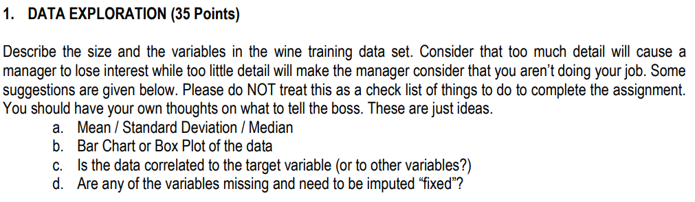
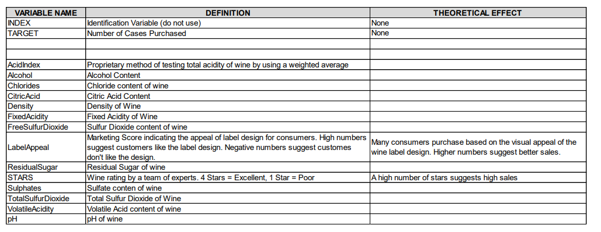
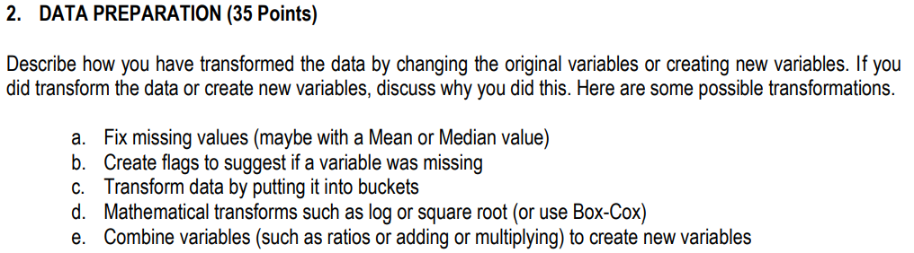
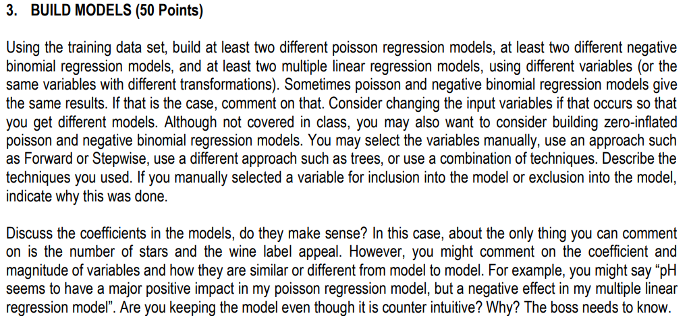
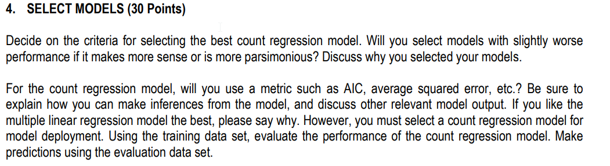

## Cover Page

Data 621 - Week 5 HW

Baron Curtin

CUNY School of Professional Studies

```{r setup, include=FALSE}
knitr::opts_chunk$set(echo = FALSE)
knitr::opts_chunk$set(tidy = TRUE)
knitr::opts_chunk$set(warning = FALSE)

loadPkg <- function(x) {
  if(!require(x, character.only = T)) install.packages(x, dependencies = T)
  require(x, character.only = T)
}

libs <- c("knitr", "magrittr", "data.table", "kableExtra", "caret", "pROC", "missForest", "zoo", "ISLR", "leaps", "fBasics", "reshape2", "tidyverse", "GGally", "gridExtra", "ROCR", "dummies", "pscl")

lapply(libs, loadPkg)
```

```{r data}
train <- fread("https://raw.githubusercontent.com/baroncurtin2/data621/master/week5/wine-training-data.csv") %>%
  as_tibble()
test <- fread("https://raw.githubusercontent.com/baroncurtin2/data621/master/week5/wine-evaluation-data.csv") %>%
  as_tibble()

# list of datasets
data <- list(train = train,
             test = test)
```

## Introduction
The purpose of this assignment is to build a count regression model to predict the number of cases of wine that will be sold given certain properties of the wine

## Data Exploration


### Non Visual Exploration

#### Variables


  * Response Variable: TARGET
    + Number of cases of wine expected the sell
  * Explanatory Variables
```{r}
data_frame(exp_vars = names(train)) %>%
  filter(!exp_vars %in% c("TARGET", "INDEX")) %>%
  arrange(exp_vars) %>%
  mutate(tag = if_else(exp_vars %in% c("STARS", "LabelAppeal"), "Non-Chemical", "Chemical"))
```
    + 12 Variables describing the chemical composition of the wine
    + 2 Variables describing non-chemical chracteristics of the wine
  * Identification Variable: INDEX
    + Will not be used in the analysis

```{r removeIndex}
# remove INDEX from datasets
data %<>%
  map(function(df) {
    df %<>%
      select(-INDEX)
    
    return(df)
  })
```

```{r}
glimpse(data$train)
```

The glimpse function of dplyr shows that there are `r nrow(data$train)` observations and `r ncol(data$train)` variables (without INDEX)
  * All of the variables are numeric
  * Various fields have missing values
  
```{r}
data$train %>%
  sapply(typeof) %>%
  as.data.frame() %>%
  rownames_to_column(var = "variable") %>%
  rename(vartype = 2) %>%
  group_by(vartype) %>%
  summarise(count = n())
```

  * 11 variables are of the double type
  * 5 variables of the integer type
  
```{r}
summary(data$train)
```

  * The summary function provides information on 8 fields that are missing values
  * The pH range is from ~0.5 to ~6.1
    + These values indicate that all of these wines are closer to acids rather than bases
    + Being alcohol, one would expect the pHs to be more basic
    
#### Basic Stats
```{r}
stats <- data$train %>%
  basicStats() %>%
  as_tibble() %>%
  rownames_to_column() %>%
  gather(var, value, -rowname)%>%
  spread(rowname, value) %>%
  rename_all(str_to_lower) %>%
  rename_all(str_trim) %>%
  rename(variables = "var",
         "q1" = `1. quartile`,
         "q3" = `3. quartile`,
         "max"= maximum,
         "min" = minimum,
         "na_vals" = nas, 
         "n" = nobs,
         "sd" = stdev,
         "var" = variance) %>%
  mutate(obs = n - na_vals,
         range = max - min,
         iqr = q3 - q1) %>%
  select(variables, n, na_vals, obs, mean, min, q1, median, q3, max, sd, var, range, iqr, skewness, kurtosis) %>%
  print
```

  * basisStats further confirms the existence of missing values in the aforemention variables
  * No variable appears to suffer from severe skew or kurtosis
  * There are a number of variables with negative values that should not contain negatives
    + These will be addressed in data preparation
    + All of the variables below except for LabelAppeal are chemical properties yet all should not contain negatives
```{r}
stats %>%
  filter(min < 0) %>%
  select(variables)
```

```{r}
# helper function
setToZero <- function(x) {
  if (is.double(x)) {
    if_else(!is.na(x) & x < 0, as.double(0), as.double(x))
  } else {
    if_else(!is.na(x) & x < 0, 0, x)
  }
}

data %<>%
  map(function(df) {
    # vars with negatives
    negs <- stats %>%
      filter(min < 0) %>%
      select(variables)
    
    # mutate values below 0 to be 0
    df %<>%
      mutate_all(as.numeric) %>%
      mutate_at(negs[["variables"]], setToZero)
    
    # return df
    return(df)
  })
```
  
#### Correlation
```{r}
data$train %>%
  cor(use = "na.or.complete") %>%
  as.data.frame() %>%
  rownames_to_column(var = "exp_var") %>%
  as_data_frame() %>%
  select(exp_var, TARGET) %>%
  filter(!exp_var %in% c("TARGET", "INDEX")) %>%
  arrange(desc(TARGET))
```

  * The correlation table above reveals that STARS and LabelAppeal have the greatest correlation with selling cases of wine
  * AcidIndex has the highest negative correlation indicating that the higher the acidity, the less cases will be sold

```{r}
ggcorr(data$train, palette = "RdBu", label = T, geom = "tile", size = 2)
```

  * The correlation matrix further confirms that values from the correlation table
  * LabelAppeal and STARS show a weak positive correlation
    + It would appear that LabelAppeal has an impact on STARS

### Visual Inspection

#### Density Plots
```{r}
vis <- data$train %>%
  melt(id.vars = "INDEX")
```

```{r}
ggplot(vis, aes(value)) +
  geom_density(fill = "skyblue") +
  facet_wrap(~ variable, scales = "free")
```


## Data Preparation


### INDEX removed from datasets
As INDEX is just an identification variable, it will be removed

### Fields with Negatives Set to 0
```{r}
negs <- stats %>%
  filter(min < 0) %>%
  select(variables) %>%
  print
```

The variables above contained values lower then zero. All of them are chemical properties of the wine (except LabelAppeal) and should not be 0. They have been changed so that their lowest value is 0. LabelAppeal also receives the same treatment because there aren't many rating scales that begin in the negatives.


## Build Models



## Select Models



## Code Appendix
```{r, ref.label=knitr::all_labels(),echo=TRUE,eval=FALSE}
```